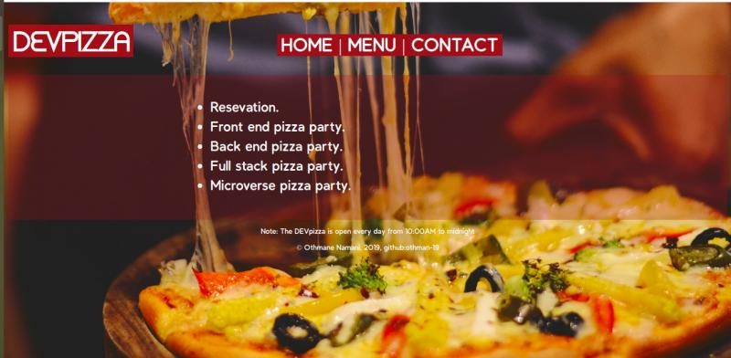

# PROJECT: RESTAURANT PAGE

The Resaturant Page is a JavaScript project, built using DOM manupilation and webpack.
The restaurant shows services, dishes and gives possibility to contact.

> Restaurant Page project is part of a series of projects to be completed by students of [Microverse](https://www.microverse.org/ 'The Global School for Remote Software Developers!').

> Restaurant Page is a project by  [Othmane Naamani](https://github.com/othman-19). The full project description can be found [here](https://www.theodinproject.com/courses/javascript/lessons/restaurant-page).

## Live Demo

The live version of the webapp can be found [here](https://othman-19.github.io/Restaurant-Page-JS/).

## Built With

- JavaScript (ES6/ES2015).
- ES6 Modules.
- DOM manipulation.
- HMTL/CSS.
- Webpack (NPM).

## Features

- Rastaurant shows its services and menus to clients.
- Restaurant provide a contact page to clients.

## Future Features

- Implmenting a reservation system.
- Implmenting an events calendar.

### Prerequisites

1. Git.
2. Code editor.
3. Code linter.

## How to run the program

1. Open the terminal.

2. Enter `$ git clone https://github.com/othman-19/Restaurant-Page-JS`.

3. Navigate to the cloned repository.

4. Go to dist folder and open index.html by the browser.

## Author(s)

[Othamane Naamani](https://github.com/othman-19/).

## Contact

[Othmane Namani](https://github.com/othman-19/)  
[Email: othmanenaamani@gmail.com](mailto:othmanenaamani@gmail.com)  
[Portfolio](https://othman-19.github.io/my_portfolio/)  
[LinkedIn](https://www.linkedin.com/in/othman-namani/)  
[twitter](https://twitter.com/ONaamani)  
[DEV Community](https://dev.to/othman)  
[Angel List](https://angel.co/othmane-namani)  

## 🤝 Contributing

Contributions, issues and feature requests are welcome!

Feel free to check the [issues page](issues/).

## Show your support

Give a ⭐️ if you like this project!

